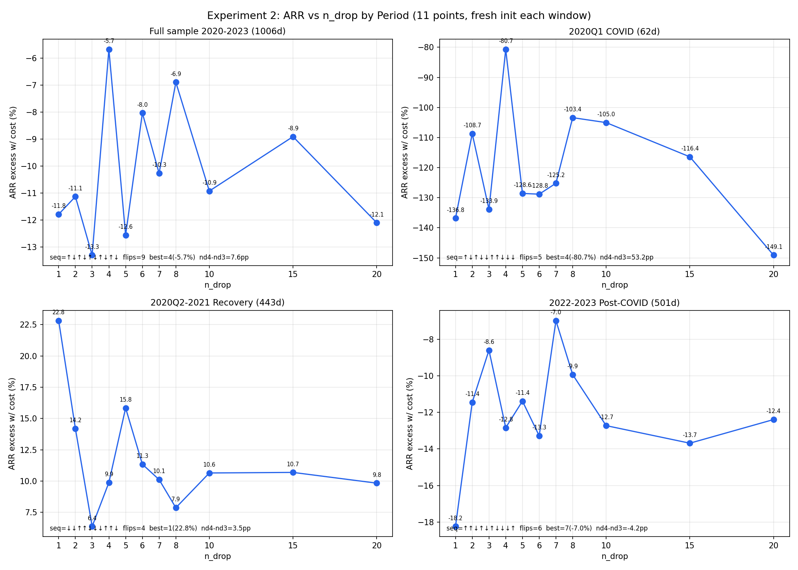

# Phase 3 Experiment 2: n_drop（Turnover）消融 — 归档总结

> **归档日期**: 2026-07-12  
> **实验编号**: Phase 3 / Experiment 2  
> **状态**: ✅ 已完成并归档（全样本 11 点、路径依赖排查、分时段 11 点验证）  
> **前置实验**: [EXPERIMENT1_TOPK_SUMMARY.md](EXPERIMENT1_TOPK_SUMMARY.md)

---

## Executive Summary

在固定 `baseline_pred.pkl`（SHA256: `27f0658b...`）、`topk=20` 的条件下，对 n_drop 进行 11 点网格消融（1,2,3,4,5,6,7,8,10,15,20），全样本 ARR 呈强烈锯齿状非单调关系，网格最优为 **n_drop=4（-5.67%）**——初版 5 点粗测的"n_drop=10 最优"已被加密结果**作废**。核心机制是**路径依赖敏感性**：相邻 n_drop（如 3 vs 4）仅差 1 只换仓，但经过数百个交易日后 EOD 持仓重叠可降至 3–7/20+ 只，导致 ARR 剧烈分化（7.6pp）；该效应非极端个股/交易日假象（剔除验证已排除）。分时段独立初始化回测进一步证实：路径依赖在 62–1006 天任意窗口均存在，最优 n_drop 强烈 regime-dependent（Q1=4、恢复=1、2022-23=7），且 nd3→nd4 的效应方向在 Q1（+53pp）与 2022-23（-4.2pp）间**反转**，证明全样本结果是多 regime 相反效应部分抵消后的净值。**结论**：组合层面不存在稳健可靠的最优换手速度规律，收益差异主要由信号噪声与路径依赖主导——与 Experiment 1 TopK 的 regime-dependent 发现相互印证。

---

## 1. 实验设置

### 1.1 固定输入与可复现性

| 项目 | 值 |
|---|---|
| 固定预测文件 | `inputs/baseline_pred.pkl` |
| SHA256 | `27f0658bc15ed87392ba87b963b2f639c1c1688d3dcb840f72373bd39b78941d` |
| 校验方式 | 全部运行通过 `--verify-hash`；manifest 已更新 |
| topk | **固定 = 20**（沿用 Experiment 1 baseline 档位） |

### 1.2 变量与对照

**最终测试网格（11 点）**：1, 2, 3, 4, 5, 6, 7, 8, 10, 15, 20

| n_drop | 配置文件 | 说明 |
|---:|---|---|
| 1 | `configs/ndrop1.yaml` | 极低换手，接近"买入并持有初始 top20" |
| **2** | `configs/baseline.yaml` | **baseline（复用 Experiment 1 数据）** |
| 3 | `configs/ndrop3.yaml` | 加密新增 |
| 4 | `configs/ndrop4.yaml` | 加密新增；**全样本网格最优** |
| 5 | `configs/ndrop5.yaml` | 中等换手 |
| 6 | `configs/ndrop6.yaml` | 加密新增 |
| 7 | `configs/ndrop7.yaml` | 加密新增 |
| 8 | `configs/ndrop8.yaml` | 加密新增 |
| 10 | `configs/ndrop10.yaml` | 较高换手；~~初版误判为全样本最优~~（已作废） |
| 15 | `configs/ndrop15.yaml` | 加密新增 |
| 20 | `configs/ndrop20.yaml` | = topk，每日可能全部换仓 |

其余参数（risk_degree=0.95、hold_thresh=1、deal_price=close、成本费率、回测窗口 2020–2023）与 baseline 完全一致。

### 1.3 实验方法

- **固定 `baseline_pred.pkl`，只重跑 PortAnaRecord**，不重新训练模型——将组合构造效应与信号质量（IC）解耦
- 初版脚本：`scripts/run_experiment2_ndrop.py`（5 点粗网格）
- 加密脚本：`scripts/run_experiment2_densify.py`（11 点全样本）
- 路径依赖排查：`scripts/investigate_ndrop34_jump.py`
- 分时段 11 点验证：`scripts/run_experiment2_period_densified.py`
- 单组运行器：`scripts/run_portfolio_ablation.py --verify-hash`
- n_drop=2 直接复用 `results/baseline/summary.json`

### 1.4 Manifest 登记

`inputs/input_hashes.txt` 新增 4 条 ndrop 配置 SHA256；校验记录见 `experiment2_ndrop/manifest_verification.json`。

---

## 2. 初版 5 点全样本结果（已被 §8 加密结果取代，保留作历史记录）

> **权威结论以 §8（11 点）和 §6（最终结论）为准。** 本节仅记录初版粗网格发现及其被推翻的过程。

所有 ARR 均为相对 P10104 的**超额收益**；Cost Drag = ARR(without cost) − ARR(with cost)。

| n_drop | ARR (w/ cost) | ARR (w/o cost) | Cost Drag | IR | MDD | 日均换手 | 平均持仓数 |
|---:|---:|---:|---:|---:|---:|---:|---:|
| **1** | -11.79% | -11.76% | **0.030%** | -0.380 | -71.86% | **1.25%** | 20.9 |
| **2** (baseline) | **-11.13%** | -11.07% | 0.066% | -0.371 | -80.98% | 2.76% | 21.7 |
| **5** | **-12.56%** | -12.30% | 0.259% | -0.391 | -70.98% | 10.87% | 23.8 |
| **10** | **-10.92%** | -9.89% | 1.029% | -0.353 | -79.11% | 43.22% | 24.8 |
| **20** | -12.10% | -9.32% | **2.783%** | -0.388 | -72.98% | **116.93%** | 23.6 |

**排序（ARR w/ cost 从高到低）**: n_drop=10 > n_drop=2 > n_drop=1 > n_drop=20 > n_drop=5

### 2.1 关键观察

- **topk=20 恒定**：平均持仓数 20.9–24.8，无异常偏离
- **日均换手随 n_drop 单调递增**：1.25% → 2.76% → 10.87% → 43.22% → 116.93%
- **Cost Drag 随 n_drop 单调递增**：0.030% → 0.066% → 0.259% → 1.029% → 2.783%
- **ARR 非单调**：初版五个测试点呈 **↑↓↑↓** 折线（见 §8 加密验证：加密后该判断已被修正）
- baseline n_drop=2（-11.13%）居中偏优

> **注意**：§2 全样本表基于初版 5 点网格（1/2/5/10/20）。§8 加密验证（11 点）后，全样本最优/最差判断已更新，请以 §8 为准。

---

## 3. 初版 5 点分时段结果（已被 §9 加密结果取代，保留作历史记录）

> **权威分时段结论以 §9（11 点加密）为准。**

与 Experiment 1 相同的三段时间切分。

### 3.1 2020Q1 — COVID 暴跌期（62 天）

| n_drop | ARR (w/ cost) | IR | MDD | 日均换手 | 平均持仓 |
|---:|---:|---:|---:|---:|---:|
| 1 | -136.8% | -2.79 | -43.0% | 11.2% | 19.7 |
| 2 | -108.7% | -2.69 | -35.7% | 16.8% | 20.0 |
| 5 | -128.6% | -2.21 | -54.7% | 49.1% | 19.7 |
| **10** | **-105.0%** | -1.82 | -46.5% | 89.3% | 20.0 |
| 20 | -149.1% | -2.57 | -50.9% | 126.5% | 19.7 |

- **最优**: n_drop=10（亏损最小）
- **最差**: n_drop=20（高换手在暴跌期伤害最大）
- 无简单单调关系

### 3.2 2020Q2–2021 — 恢复期（443 天，权重最大）

| n_drop | ARR (w/ cost) | IR | MDD | 日均换手 | 平均持仓 |
|---:|---:|---:|---:|---:|---:|
| **1** | **+22.82%** | +0.58 | -46.5% | **0.29%** | 21.0 |
| 2 | +14.19% | +0.46 | -37.2% | 1.47% | 21.9 |
| 5 | +15.84% | +0.48 | -44.9% | 22.1% | 22.6 |
| 10 | +10.65% | +0.35 | -46.8% | 56.1% | 23.5 |
| 20 | +9.84% | +0.32 | -37.9% | 124.0% | 22.5 |

- **最优**: n_drop=1（低换手、持有初始组合捕获反弹）
- **单调递减**：n_drop 越大 ARR 越低（在恢复期为正收益时）
- n_drop=1 比 n_drop=20 高出 **13.0pp**

### 3.3 2022–2023 — post-COVID（501 天）

| n_drop | ARR (w/ cost) | IR | MDD | 日均换手 | 平均持仓 |
|---:|---:|---:|---:|---:|---:|
| 1 | -18.24% | -0.71 | -64.8% | 0.78% | 20.9 |
| 2 | -11.45% | -0.42 | -68.8% | 12.1% | 20.8 |
| **5** | **-11.38%** | -0.43 | -71.5% | 32.3% | 21.6 |
| 10 | -12.73% | -0.48 | -74.2% | 85.3% | 21.0 |
| 20 | -12.39% | -0.46 | -70.8% | 134.8% | 21.0 |

- **最优**: n_drop=5（略优于 baseline n_drop=2）
- 方向与恢复期相反：适度换手（5）优于极低换手（1）

### 3.4 分时段最优 n_drop 汇总

| 时段 | 最优 n_drop | ARR | 日均换手 |
|---|---:|---:|---:|
| 2020Q1 暴跌 | **10** | -105.0% | 89.3% |
| 2020Q2–2021 恢复 | **1** | +22.8% | 0.29% |
| 2022–2023 正常 | **5** | -11.4% | 32.3% |

**结论：Turnover–ARR 关系同样是 regime-dependent 的**，与 Experiment 1 TopK 发现一致。不存在跨时段的全局最优 n_drop。

---

## 4. 初版关系分析（5 点，部分结论仍成立）

### 4.1 Cost Drag 与 Turnover 的关系

**验证结果：成立（单调）。**

| n_drop | 日均换手 | Cost Drag |
|---:|---:|---:|
| 1 | 1.25% | 0.030% |
| 2 | 2.76% | 0.066% |
| 5 | 10.87% | 0.259% |
| 10 | 43.22% | 1.029% |
| 20 | 116.93% | 2.783% |

n_drop 越大 → 实际换手越高 → Cost Drag 单调上升。但 Cost Drag 绝对值仍很小（全样本最大 2.78%），**不足以解释 ARR 间的 1–2pp 差异**，更无法解释时段间 13pp 量级的差异。

### 4.2 Turnover 与 ARR 的关系

**验证结果：非单调，regime-dependent；全样本形状需看图，不能用线性相关系数推断。**

全样本 5 个测试点的 ARR 折线（`task3_arr_vs_ndrop_curve.png`）：

```
n_drop:  1      2      5      10     20
ARR(%): -11.79 -11.13 -12.56 -10.92 -12.10
走势:         ↑      ↓      ↑      ↓
```

**形状判定**：
- **不是**从 n_drop=1 到 20 的完整倒 U 型（1→2 先升、2→5 再降，前段已破坏单一倒 U）
- 更准确描述：**不规则非单调**；n_drop=5 为全样本网格谷底，n_drop=10 为全样本网格峰值
- 子区间 5→10→20 呈"先升后降"，**局部**类似倒 U，但不能外推到整条曲线

> **表述修正**：线性相关系数（n_drop vs ARR ≈ -0.16）仅反映弱线性趋势，**不能用于证明或证伪非线性的倒 U 型**；非线性形状应以折线图逐点比对为准。

分时段方向不一致：
  - 暴跌期：中等换手（10）最优，极高换手（20）最差
  - 恢复期：换手越低越好（1 >> 20）
  - 2022–2023：适度换手（5）最优

### 4.3 "信号追踪 vs 降噪"权衡 — 是否存在最优换手速度？

**两层含义需区分，避免"全样本最优"与"无全局最优"打架：**

| 概念 | 含义 | 初版 5 点结论 | **最终 11 点结论** |
|---|---|---|---|
| **全样本网格最优** | 合并 2020–2023 回测后的最高 ARR | ~~n_drop=10（-10.92%）~~ **已作废** | **n_drop=4（-5.67%）** |
| **跨 regime 全局最优** | 三个市场阶段均表现最优的单一 n_drop | **不存在** | **不存在**（§9：Q1=4 / 恢复=1 / 2022-23=7） |

因此：
- ~~说"全样本最优 n_drop=10"~~ → **作废**；加密后修正为 **n_drop=4**
- 说"无全局最优换手速度"——指的是**跨市场阶段无单一稳健最优**，成立
- 全样本 ndrop=4 是 **pooled-sample optimum**，非 regime-robust universal optimum

| 机制 | 低 n_drop（持有/降噪） | 高 n_drop（追踪/摩擦） |
|---|---|---|
| 优势 | 平滑日度排名噪声；降低交易摩擦 | 更快跟随信号变化 |
| 劣势 | 信号漂移时反应迟钝 | 追逐噪声；换手/成本上升 |
| 全样本 ARR | n_drop=1: -11.79% | n_drop=20: -12.10% |
| 恢复期 ARR | n_drop=1: **+22.8%** | n_drop=20: +9.8% |

**结论**：n_drop 本质上是"跟随最新信号"与"降噪/减少摩擦"之间的权衡。全样本在粗网格上 n_drop=10 略优于 baseline，但分时段最优从 1 到 10 漂移，**不支持跨 regime 的单一全局最优换手速度**。

### 4.4 极端对比：n_drop=1 vs n_drop=20

用于验证 Experiment 1 中"完全静态持仓"vs"完全追逐最新排名"两种假设：

| 维度 | n_drop=1（近静态） | n_drop=20（近全换） |
|---|---:|---:|
| 全样本 ARR (w/ cost) | **-11.79%** | -12.10% |
| 全样本 ARR (w/o cost) | -11.76% | **-9.32%** |
| Cost Drag | 0.030% | **2.783%** |
| 日均换手 | **1.25%** | 116.93% |
| 恢复期 ARR | **+22.8%** | +9.8% |
| 暴跌期 ARR | -136.8% | -149.1% |

**解读**：

1. **含成本口径**：n_drop=1 优于 n_drop=20（-11.79% vs -12.10%），支持"降噪/低换手"在全样本略优
2. **无成本口径**：n_drop=20 反而更好（-9.32% vs -11.76%），说明高换手的**信号追踪本身有一定价值**，但被 2.78% Cost Drag 侵蚀
3. **恢复期**（权重最大）：n_drop=1 大幅领先 n_drop=20（+22.8% vs +9.8%），是对 Experiment 1 "n_drop 降噪价值"最直接的验证
4. 对比 Experiment 1 的理想化"每日全量再平衡"（-16.56%）：n_drop=20（-12.10%）和 n_drop=1（-11.79%）均显著优于完全追逐，但 n_drop=2/10 进一步在两者之间取得平衡

**哪个更能验证 Experiment 1 的两种假设？**
- **n_drop=1** 更好地代表"低换手/近静态持仓"假设
- **n_drop=20** 更好地代表"严格追逐每日最新排名"假设（但仍受 TopkDropoutStrategy 机制约束，非理想化每日全换）
- 两者对比支持 Experiment 1 结论：**在噪声大的信号下，适度抑制换仓优于盲目追踪**

---

## 5. 与 Experiment 1 的交叉验证

| Experiment 1 发现 | Experiment 2 验证 |
|---|---|
| n_drop=2 相对每日全换减少亏损 | 确认：n_drop=20 全样本 -12.10%，n_drop=2 -11.13%；理想每日全换 -16.56% |
| 日度排名剧烈变动（重叠率 6.3%） | 确认：n_drop=1 换手 1.25% 仍获恢复期 +22.8% |
| 最优参数 regime-dependent | 确认：三时段最优 n_drop 分别为 10 / 1 / 5 |
| 交易成本不是主因 | 确认：最大 Cost Drag 2.78%，ARR 差异由换仓机制主导 |

---

## 6. 最终结论（整合 §1–§9）

### 6.1 实验设计与可复现性

- 固定 `baseline_pred.pkl`（SHA256: `27f0658bc15ed87392ba87b963b2f639c1c1688d3dcb840f72373bd39b78941d`），`topk=20`，只重跑 PortAnaRecord
- 测试 n_drop：1, 2, 3, 4, 5, 6, 7, 8, 10, 15, 20（11 点最终网格）
- 回测窗口：2020-01-01 ~ 2023-12-31（1006 交易日）

### 6.2 全样本 ARR 形态

- 11 点 ARR 呈**强烈锯齿状**（方向序列 ↑↓↑↓↑↓↑↓↑↓，9 次翻转），**非单调、非平滑倒 U**
- 网格最优：**n_drop=4（-5.67%）**；网格最差：**n_drop=3（-13.30%）**
- 相邻整数可差 **7pp+**（ndrop 3→4：+7.6pp）
- **初版 5 点"峰=10、谷=5"及"n_drop=10 最优"已作废**

### 6.3 核心机制：路径依赖敏感性

| 证据 | 内容 |
|---|---|
| 持仓分叉 | 高差额日 EOD 持仓重叠仅 **3–7/20+** 只（非"只差 1 只"） |
| 时间尺度 | 早期微小换仓差异经数百日累积，两套组合走向几乎完全不同的轨迹 |
| 排除假象 | 剔除 top10 极端差额日后 nd4−nd3 仍有 **7.45pp**；锯齿未平滑 |
| 分时段验证 | 独立初始化后，62–1006 天窗口均仍呈锯齿（翻转 4–9 次） |

**机制表述**：n_drop 微小变化 → 持仓轨迹路径依赖分叉 → 全样本 ARR 剧烈分化。这是**累积性系统效应**，非极端个股/单日运气。

### 6.4 分时段与 regime-dependent

| 窗口 | 天数 | 最优 n_drop | nd4−nd3 | 锯齿翻转 |
|---|---:|---:|---:|---:|
| 全样本 | 1006 | **4** | +7.6pp | 9 |
| 2020Q1 COVID | 62 | **4** | +53.2pp | 5 |
| 2020Q2-2021 恢复 | 443 | **1** | +3.5pp | 4 |
| 2022-2023 | 501 | **7** | **−4.2pp** | 6 |

关键发现：
1. **最优 n_drop 强烈 regime-dependent**（4 / 4 / 1 / 7），与 TopK 消融同构
2. **nd3→nd4 效应方向可反转**（Q1 中 nd4 大幅占优，2022-23 中 nd3 占优）
3. 全样本 ndrop=4 优势 = 多 regime 相反路径分叉的**净效应**，非单纯时间累积

### 6.5 与 Experiment 1 的交叉印证

| 共同发现 | Experiment 1 (TopK) | Experiment 2 (n_drop) |
|---|---|---|
| regime-dependent 最优参数 | Q1=50, 恢复=10, 2022-23=20 | Q1=4, 恢复=1, 2022-23=7 |
| 无跨 regime 全局最优 | 确认 | 确认 |
| 交易成本非主因 | Cost drag ~0.07pp | Cost drag 最大 2.78%，仍不足以解释 ARR 差异 |
| 信号噪声主导组合差异 | 日度排名重叠率 6.3% | 路径依赖导致持仓轨迹大幅分叉 |

### 6.6 论文级结论定位

> **组合层面收益差异主要由信号噪声与路径依赖主导，不存在稳健可靠的最优换手速度规律。** 任何在粗网格上观察到的"最优 n_drop"都是样本内、regime 特定的 pooled optimum，不具备外推价值。这一发现与 Experiment 1 的 TopK regime-dependent 结论相互印证，共同支持 Phase 3 核心论点：在噪声大的日度排名信号下，组合构造参数的"最优化"是幻觉，稳健性应通过 regime 分析而非单点网格搜索来评估。

---

## 7. 实验演进时间线

| 阶段 | 内容 | 状态 |
|---|---|---|
| 初版 5 点网格 | 全样本 + 三时段 + 关系分析 | ✅ 完成；结论已被加密推翻 |
| 11 点加密采样 | 揭示锯齿真实性；修正最优为 ndrop=4 | ✅ 完成 |
| ndrop3→4 跳变排查 | 路径依赖机制；排除极端日假象 | ✅ 完成 |
| 分时段 11 点验证 | regime-dependent + 效应方向反转 | ✅ 完成 |
| 正式归档 | 本文档 + `docs/decisions.md` | ✅ 完成 |

**后续 Experiment 3（hold_thresh）建议**：直接采用密集采样，不再"先粗测后加密"（见 `docs/decisions.md`）。

---

## 8. 加密采样验证（n_drop = 3,4,6,7,8,15）

### 8.1 目的

验证初版 5 点折线的 ↑↓↑↓ 锯齿，究竟是真实非线性关系，还是 2→10 跳跃过大造成的采样假象。

### 8.2 方法与执行

- 新增 n_drop = 3, 4, 6, 7, 8, 15（与 Experiment 2 完全一致）
- 固定 `baseline_pred.pkl`（SHA256 `27f0658b...`，verify-hash 通过）
- topk=20，只跑 PortAnaRecord
- 与原有 5 点合并为 **11 点**：1, 2, 3, 4, 5, 6, 7, 8, 10, 15, 20
- 分时段加密扩展：见 **§9**（三时段 × 11 点，各自独立初始化）

### 8.3 11 点全样本完整表

| n_drop | ARR (w/ cost) | ARR (w/o cost) | Cost Drag | IR | MDD | 日均换手 | 新增？ |
|---:|---:|---:|---:|---:|---:|---:|:---:|
| 1 | -11.79% | -11.76% | 0.030% | -0.380 | -71.86% | 1.25% | |
| 2 (baseline) | -11.13% | -11.07% | 0.066% | -0.371 | -80.98% | 2.76% | |
| **3** | **-13.30%** | -13.24% | 0.064% | -0.462 | -70.29% | 2.71% | **新增** |
| **4** | **-5.67%** | -5.51% | 0.166% | -0.187 | -69.66% | 6.99% | **新增** |
| 5 | -12.56% | -12.30% | 0.259% | -0.391 | -70.98% | 10.87% | |
| **6** | -8.03% | -7.58% | 0.452% | -0.249 | -69.93% | 18.97% | **新增** |
| **7** | -10.27% | -9.80% | 0.466% | -0.324 | -78.63% | 19.58% | **新增** |
| **8** | -6.89% | -6.16% | 0.728% | -0.218 | -72.42% | 30.57% | **新增** |
| 10 | -10.92% | -9.89% | 1.029% | -0.353 | -79.11% | 43.22% | |
| **15** | -8.91% | -6.86% | 2.045% | -0.289 | -74.23% | 85.92% | **新增** |
| 20 | -12.10% | -9.32% | 2.783% | -0.388 | -72.98% | 116.93% | |

折线图：`task3_arr_vs_ndrop_curve.png`（蓝点=原 5 点，橙方块=新增 6 点）

### 8.4 三个判断问题的回答

**Q1：加密后走势更平滑还是依然锯齿？**

**依然锯齿，且更"抖"。** 11 点方向序列为 **↑↓↑↓↑↓↑↓↑↓**（10 段中 9 次换向），比初版 5 点的 ↑↓↑↓ 更不规则。未出现平滑倒 U 或单调趋势。**锯齿不是采样稀疏造成的假象，而是真实的强非线性/高敏感性。**

**Q2：是否存在明显的局部峰/谷？**

是，且多个：

| 类型 | n_drop | ARR (w/ cost) |
|---|---:|---:|
| **全局峰值** | **4** | **-5.67%** |
| 局部峰值 | 8 | -6.89% |
| 局部峰值 | 15 | -8.91% |
| 局部峰值 | 6 | -8.03% |
| 局部峰值 | 2 | -11.13% |
| 局部谷值 | 3 | -13.30% |
| 局部谷值 | 5 | -12.56% |
| 局部谷值 | 20 | -12.10% |
| 局部谷值 | 10 | -10.92% |
| 局部谷值 | 7 | -10.27% |

相邻点可剧烈跳变：n_drop=3→4 回升 **+7.6pp**，n_drop=4→5 回落 **-6.9pp**。

**Q3：初版"峰=10、谷=5"是否还成立？**

**均被推翻。**

| 判断 | 初版 5 点 | 加密 11 点后 |
|---|---|---|
| 全样本最优 | n_drop=10（-10.92%） | **n_drop=4（-5.67%）** |
| 全样本最差 | n_drop=5（-12.56%） | **n_drop=3（-13.30%）** |
| n_drop=10 地位 | 网格峰值 | 降为局部谷值（-10.92%，低于 4/6/8/15） |
| n_drop=5 地位 | 网格谷底 | 仍为深谷之一，但最差让位给 n_drop=3 |

### 8.5 加密验证结论

1. **锯齿是真实非线性**，不是 2→10 稀疏采样的人为产物
2. **ARR 对 n_drop 极度敏感**：相邻整数可差 7pp 量级，粗网格无法可靠定位最优
3. 初版"全样本最优 n_drop=10"**作废**；加密后修正为 **n_drop=4（-5.67%）**
4. 路径依赖机制见 §8.6；分时段验证见 §9

### 8.6 n_drop=3→4 跳变排查（7.6pp 归因验证）

针对 n_drop=3（-13.30%）与 n_drop=4（-5.67%）之间 7.6pp 跳变，做了逐日收益/持仓/极端股票/剔除重算排查。输出目录：`ndrop34_jump_investigation/`。

**任务1：贡献最大的交易日**

| 日期 | excess_nd3 | excess_nd4 | 当日差额(nd4−nd3) | 备注 |
|---|---:|---:|---:|---|
| 2020-11-09 | +5.39% | +10.77% | **+5.38%** | 单日最大；拜登胜选后行情 |
| 2020-03-17 | -7.15% | -3.49% | +3.66% | COVID 反弹日 |
| 2021-01-28 | +4.19% | +0.92% | -3.27% | nd3 更好 |
| 2020-03-20 | -5.02% | -1.90% | +3.12% | COVID |
| 2020-08-10 | +1.99% | +4.81% | +2.82% | |

但差异**不集中**于少数日期：累积 |diff| 质量的 50% 需要 **205/1006 天**，80% 需要 **463 天**。

**任务2：持仓差异（重要意外）**

在高差额日，两策略持仓重叠仅 **3–7 只/20+**（约 70–85% 不同），**并非"只差 1 只股票"**。

原因：n_drop 差 1 在 1006 天内经路径依赖累积，两套组合已走向**几乎完全不同的持仓轨迹**（早期微小换仓差异逐日放大）。

**任务3：极端差异股票**

在 COVID 期间（2020-03）差异股票存在大幅 label 波动，例如：
- P13142（仅 nd3 持有，2020-03-17）：超额 **+37.9%**
- P77730（仅 nd4 持有，2020-03-17）：超额 **+27.4%**
- P21207（仅 nd4，2020-03-11）：超额 **-31.5%**

共 40 条 |excess|>10% 的差异股票-日记录，主要集中在 2020Q1–Q2。但 2020-11-09 最大差额日的差异股票收益多在 ±5–8% 量级，**非单一暴雷股可解释**。

**任务4：剔除极端日后 ARR 序列**

| 剔除方案 | 剔除天数 | nd4−nd3 差距 | 11点方向序列 | 锯齿是否减弱 |
|---|---:|---:|---|:---:|
| 无剔除 | 0 | **7.63pp** | ↑↓↑↓↑↓↑↓↑↓ | — |
| Top5 \|diff\| 日 | 5 | 4.89pp | ↓↓↑↓↑↓↑↓↑↓ | 否 |
| Top10 \|diff\| 日 | 10 | **7.45pp** | ↓↓↑↓↑↓↑↓↑↓ | **否** |
| Top20 \|diff\| 日 | 20 | 5.79pp | ↓↓↑↓↑↓↑↓↑↓ | 否 |
| 含极端股>10%的日 | 5 | 6.67pp | ↑↓↑↓↑↓↑↓↑↓ | 否 |

剔除后 **nd4 仍显著优于 nd3**（top10 剔除后 nd4=-3.97% vs nd3=-11.41%），11 点折线**仍为锯齿，未平滑为单调或倒 U**。

**排查结论（修订）**

1. 7.6pp 跳变**不主要由 1–2 个极端交易日/极端股票偶然主导**；剔除 top10 差额日后差距仍有 7.45pp
2. 但差异在 COVID 段更密集，且存在路径依赖导致的**组合轨迹大幅分叉**（重叠率极低），这比"每天多换 1 只"的直觉更剧烈
3. **"ARR 对 n_drop 极度敏感"应修订为**：n_drop 微小变化 → 长期路径依赖 → 持仓轨迹显著分化 → 全样本 ARR 大幅分化；这是**累积性系统效应**，而非单日运气
4. n_drop=4 全样本最优（-5.67%）仍成立，但需谨慎对待其是否过拟合于特定历史路径

---

## 9. 分时段 11 点加密验证（路径依赖机制复核）

> **目的**：验证 §8.6 的"路径依赖累积"假说——早期微小持仓差异是否在更短时间窗口下仍产生锯齿状 ARR 曲线，以及 ndrop=3→4 的 7.6pp 跳变是否随窗口缩短而缩小。  
> **方法**：11 点 n_drop（1,2,3,4,5,6,7,8,10,15,20），三时段**各自独立初始化持仓**（不延续上一段状态），固定 `baseline_pred.pkl`，只重跑 PortAnaRecord。  
> **脚本**：`scripts/run_experiment2_period_densified.py`  
> **输出目录**：`results/experiment2_ndrop/period_densified/`

### 9.1 各时段 ARR vs n_drop（11 点，w/ cost）

| n_drop | 全样本 (1006d) | 2020Q1 (62d) | 2020Q2-21 (443d) | 2022-23 (501d) |
|---:|---:|---:|---:|---:|
| 1 | -11.79% | -136.85% | **+22.82%** | -18.24% |
| 2 | -11.13% | -108.72% | +14.19% | -11.45% |
| 3 | **-13.30%** | -133.88% | +6.38% | **-8.60%** |
| 4 | **-5.67%** | **-80.70%** | +9.89% | -12.84% |
| 5 | -12.56% | -128.59% | +15.84% | -11.38% |
| 6 | -8.03% | -128.83% | +11.34% | -13.28% |
| 7 | -10.27% | -125.21% | +10.12% | **-6.98%** |
| 8 | -6.89% | -103.40% | +7.87% | -9.93% |
| 10 | -10.92% | -105.04% | +10.65% | -12.73% |
| 15 | -8.91% | -116.42% | +10.69% | -13.69% |
| 20 | -12.10% | -149.11% | +9.84% | -12.39% |

### 9.2 锯齿形态与方向翻转次数

| 窗口 | 天数 | 方向序列 (11点) | 翻转次数 | 是否仍锯齿 |
|---|---:|---|---:|---|
| 全样本 2020-23 | 1006 | ↑↓↑↓↑↓↑↓↑↓ | **9** | 是 |
| 2020Q1 COVID | 62 | ↑↓↑↓↓↓↑↓↓ | **5** | 是（减弱） |
| 2020Q2-2021 恢复 | 443 | ↓↓↑↑↓↓↓↑↑↓ | **4** | 是（最弱） |
| 2022-2023 | 501 | ↑↑↓↑↓↑↓↓↓↑ | **6** | 是 |

**回答 Q1**：三个子窗口**均仍呈锯齿状**，但翻转次数随窗口缩短而下降（9 → 5/4/6）。恢复期（443d）锯齿最弱，呈近似单调下降后局部回升；**并非**"短窗口就完全平滑"。这说明 n_drop 敏感性在短期也存在，但**长时间累积会进一步放大锯齿幅度与翻转密度**。

### 9.3 各时段最优 n_drop（regime-dependent）

| 窗口 | 最优 n_drop | 最优 ARR | 最差 n_drop | 最差 ARR |
|---|---:|---:|---:|---:|
| 全样本 | **4** | -5.67% | 3 | -13.30% |
| 2020Q1 | **4** | -80.70% | 20 | -149.11% |
| 2020Q2-2021 | **1** | +22.82% | 3 | +6.38% |
| 2022-2023 | **7** | -6.98% | 1 | -18.24% |

**回答 Q2**：最优 n_drop **强烈 regime-dependent**，与 TopK 结论一致。仅 2020Q1 与全样本同为 n_drop=4；恢复期偏好极低换手（ndrop=1），2022-23 偏好 ndrop=7。**不存在跨 regime 的全局最优 n_drop**；全样本 ndrop=4 是 pooled-sample optimum，不能外推。

### 9.4 ndrop=4 vs ndrop=3 差距（路径依赖时间尺度检验）

| 窗口 | 天数 | nd4 ARR | nd3 ARR | nd4−nd3 | 相对全样本 |
|---|---:|---:|---:|---:|---|
| 全样本 | 1006 | -5.67% | -13.30% | **+7.63pp** | 基准 |
| 2020Q1 | 62 | -80.70% | -133.88% | **+53.17pp** | **更大**（×7.0） |
| 2020Q2-2021 | 443 | +9.89% | +6.38% | +3.51pp | 更小 |
| 2022-2023 | 501 | -12.84% | -8.60% | **−4.24pp** | **符号反转**（nd3 更优） |

**回答 Q3**：2020Q1（62 天）的 nd4−nd3 差距**并未缩小，反而远大于全样本**（53pp vs 7.6pp）。但这**不能**简单否定路径依赖——COVID 暴跌期 ARR 绝对值极大（-80% ~ -150%），短期高波动下微小路径分叉即可产生巨大 pp 差距。更关键的证据是：**2022-23 子窗口 nd3 反而优于 nd4（−4.2pp）**，说明全样本 nd4 优势来自**特定 regime 的路径分叉叠加**，而非"时间越长差距单调增大"。

**修订后的机制理解**：

1. n_drop 微小差异 → 持仓轨迹分叉（路径依赖），在**任意长度窗口**均可产生显著 ARR 差异
2. 全样本 7.6pp 跳变 = 多 regime 路径分叉的**净效应**（Q1 贡献 nd4 优势，2022-23 贡献 nd3 优势，恢复期中等等）
3. "时间越长累积越明显"应修正为："**跨 regime 连续回测时，早期分叉无法被后续重置消除，因此全样本结果不等于各子窗口的加权平均**"

### 9.5 四面板对比图



单时段图：
- `period_densified/arr_vs_ndrop_2020Q1_COVID.png`
- `period_densified/arr_vs_ndrop_2020Q2_2021_recovery.png`
- `period_densified/arr_vs_ndrop_2022_2023_post_covid.png`

### 9.6 本节结论

| 问题 | 结论 |
|---|---|
| 短窗口是否仍锯齿？ | **是**，但翻转次数减少（9→4~6） |
| 最优 n_drop 是否一致？ | **否**，4 / 4 / 1 / 7（全样本/Q1/恢复/2022-23） |
| Q1 的 nd3-4 差距是否缩小？ | **否**，Q1 差距 53pp >> 全样本 7.6pp；但 2022-23 符号反转 |
| 路径依赖机制 | **确认存在**；全样本锯齿 = 多 regime 路径分叉净效应，非简单时间累积 |

---

## 附录 A：支撑性数据文件清单

### A.1 本实验输出（experiment2_ndrop/）

| 路径 | 说明 |
|---|---|
| `results/experiment2_ndrop/task1_full_sample.csv` | 全样本五组指标（初版） |
| `results/experiment2_ndrop/task1_full_sample_densified.csv` | 全样本十一组指标（加密版） |
| `results/experiment2_ndrop/task1_full_sample_densified.json` | 同上 JSON |
| `results/experiment2_ndrop/densification_manifest_verification.json` | 加密运行 manifest 校验 |
| `results/experiment2_ndrop/densify_run.log` | 加密运行日志 |
| `results/experiment2_ndrop/ndrop34_jump_investigation/investigation_summary.json` | ndrop3 vs 4 跳变排查总结 |
| `results/experiment2_ndrop/ndrop34_jump_investigation/daily_excess_diff_nd4_minus_nd3.csv` | 逐日 excess 差额 |
| `results/experiment2_ndrop/ndrop34_jump_investigation/task1_top_diff_days.csv` | 差额最大交易日 |
| `results/experiment2_ndrop/ndrop34_jump_investigation/task2_holdings_diff_top_days.csv` | 高差额日持仓差异 |
| `results/experiment2_ndrop/ndrop34_jump_investigation/task3_extreme_diff_stocks.csv` | 极端差异股票 |
| `results/experiment2_ndrop/ndrop34_jump_investigation/task4_trimmed_arr_comparison.json` | 剔除极端日后 11 点 ARR |
| `results/experiment2_ndrop/ndrop34_jump_investigation/task4_arr_curve_full_vs_trimmed.png` | 剔除前后曲线对比 |
| `results/experiment2_ndrop/period_densified/task_period_densified_all.csv` | 三时段 × 11 n_drop 全指标 |
| `results/experiment2_ndrop/period_densified/period_analysis_summary.json` | 各时段锯齿/最优/nd3-4 差距 |
| `results/experiment2_ndrop/period_densified/key_findings.json` | 路径依赖检验结论 |
| `results/experiment2_ndrop/period_densified/arr_vs_ndrop_four_panel.png` | 四面板 ARR vs n_drop 对比 |
| `results/experiment2_ndrop/period_densified/arr_vs_ndrop_2020Q1_COVID.png` | Q1 单时段折线图 |
| `results/experiment2_ndrop/period_densified/arr_vs_ndrop_2020Q2_2021_recovery.png` | 恢复期单时段折线图 |
| `results/experiment2_ndrop/period_densified/arr_vs_ndrop_2022_2023_post_covid.png` | 2022-23 单时段折线图 |
| `results/experiment2_ndrop/task1_full_sample.json` | 同上 JSON |
| `results/experiment2_ndrop/task2_by_period.csv` | 三时段 × 五 n_drop |
| `results/experiment2_ndrop/task3_relationship_analysis.json` | 关系分析结论 |
| `results/experiment2_ndrop/task3_shape_verification.json` | 全样本 ARR 折线形状判定 |
| `results/experiment2_ndrop/task3_arr_vs_ndrop_curve.png` | 全样本 ARR vs n_drop 折线图 |
| `results/experiment2_ndrop/manifest_verification.json` | manifest 校验 |
| `results/experiment2_ndrop/ndrop1/summary.json` | n_drop=1 全样本详情 |
| `results/experiment2_ndrop/ndrop1/effective_config.yaml` | 生效配置 |
| `results/experiment2_ndrop/ndrop2/summary.json` | baseline 复用 |
| `results/experiment2_ndrop/ndrop2/effective_config.yaml` | 生效配置 |
| `results/experiment2_ndrop/ndrop3/summary.json` | n_drop=3 全样本详情（加密新增） |
| `results/experiment2_ndrop/ndrop4/summary.json` | n_drop=4 全样本详情（加密新增） |
| `results/experiment2_ndrop/ndrop5/summary.json` | n_drop=5 全样本详情 |
| `results/experiment2_ndrop/ndrop5/effective_config.yaml` | 生效配置 |
| `results/experiment2_ndrop/ndrop6/summary.json` | n_drop=6 全样本详情（加密新增） |
| `results/experiment2_ndrop/ndrop7/summary.json` | n_drop=7 全样本详情（加密新增） |
| `results/experiment2_ndrop/ndrop8/summary.json` | n_drop=8 全样本详情（加密新增） |
| `results/experiment2_ndrop/ndrop10/summary.json` | n_drop=10 全样本详情 |
| `results/experiment2_ndrop/ndrop10/effective_config.yaml` | 生效配置 |
| `results/experiment2_ndrop/ndrop15/summary.json` | n_drop=15 全样本详情（加密新增） |
| `results/experiment2_ndrop/ndrop20/summary.json` | n_drop=20 全样本详情 |
| `results/experiment2_ndrop/ndrop20/effective_config.yaml` | 生效配置 |
| `results/experiment2_ndrop/run.log` | 完整运行日志 |

### A.2 配置与脚本

| 路径 | 说明 |
|---|---|
| `configs/ndrop1.yaml` | n_drop=1 |
| `configs/ndrop3.yaml` | n_drop=3 |
| `configs/ndrop4.yaml` | n_drop=4 |
| `configs/ndrop5.yaml` | n_drop=5 |
| `configs/ndrop6.yaml` | n_drop=6 |
| `configs/ndrop7.yaml` | n_drop=7 |
| `configs/ndrop8.yaml` | n_drop=8 |
| `configs/ndrop10.yaml` | n_drop=10 |
| `configs/ndrop15.yaml` | n_drop=15 |
| `configs/ndrop20.yaml` | n_drop=20 |
| `configs/baseline.yaml` | n_drop=2 (baseline) |
| `inputs/input_hashes.txt` | 更新后的 manifest（15 条目） |
| `inputs/baseline_pred.pkl` | 固定预测 |
| `scripts/run_experiment2_ndrop.py` | 批量运行 + 分析脚本 |
| `scripts/run_experiment2_densify.py` | 加密采样批量脚本 |
| `scripts/run_experiment2_period_densified.py` | 分时段 11 点加密验证脚本 |
| `scripts/investigate_ndrop34_jump.py` | ndrop3 vs 4 跳变排查脚本 |
| `scripts/run_portfolio_ablation.py` | 单组 PortAna 运行器 |

### A.3 Experiment 1 交叉引用

| 路径 | 说明 |
|---|---|
| `results/EXPERIMENT1_TOPK_SUMMARY.md` | TopK 消融归档 |
| `results/gap_decomposition/gap_decomposition_summary.json` | 8pp 缺口拆解 |
| `results/baseline/summary.json` | n_drop=2 原始输出 |

---

## 附录 B：关键数字速查

```
全样本 ARR (11点, w/ cost):  n_drop=4 (-5.67%) > 8 (-6.89%) > 15 (-8.91%) > 6 (-8.03%) > 2 (-11.13%) > ...
全样本折线(11点):           ↑↓↑↓↑↓↑↓↑↓  （更抖，非平滑；锯齿为真实非线性）
初版峰/谷(5点):             峰=10 谷=5  → 加密后推翻：峰=4 谷=3
Cost Drag 单调(11点):       仍随 n_drop 递增
分时段最优(初版5点):        Q1=10 / 恢复=1 / 2022-23=5
分时段最优(11点加密):       Q1=4 / 恢复=1 / 2022-23=7 / 全样本=4
nd4-nd3 差距:               全样本=7.6pp / Q1=53.2pp / 恢复=3.5pp / 2022-23=-4.2pp
锯齿翻转次数(11点):         全样本=9 / Q1=5 / 恢复=4 / 2022-23=6
```

---

*本文件为 Phase 3 Experiment 2 的权威归档（最终版）。Experiment 1 见 `EXPERIMENT1_TOPK_SUMMARY.md`。方法论决策见 `wrds_project/docs/decisions.md` § Phase 3 Experiment 2。*
